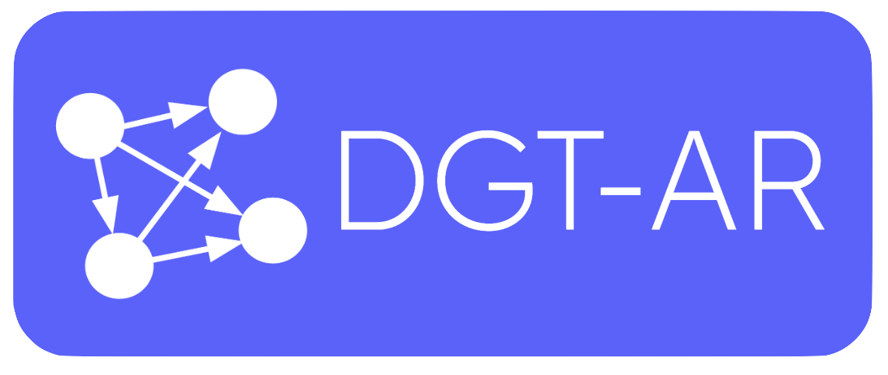

<p align="center">
  <a  target="blank"></a>
</p>

<p align="center"> 
Dependency Graph Tool in Augmented Reality (DGT-AR),a visualization tool that supports change impact analysis by allowing developers to interact with a code dependency graph in immersive AR. DGT-AR uses the node-link diagram visualization technique to provide an overview of the dependencies in a software system. 
</p>

<p align="center">
  <a href="https://code.visualstudio.com/">
    
  </a>
  <a href="https://nodejs.org/en">
    
  </a>
  <a href="https://yeoman.io/">
    
  </a>
</p>


## App overview

DGT-AR is a visualization tool that comprises three essential components. To gain a comprehensive understanding of the entire system, please visit the following GitHub repository [DGT-AR](https://github.com/DussanFreire/DGT-AR). 

The VS Code  facilitates remote interactions with the graph visuazation in the AR APP.

## VS Code extension installation
Before proceeding with the installation, please ensure that you have the required versions of Vs Code and Node.js installed, as specified at the beginning. Once you have verified the versions, you can proceed with the installation process.To install the VS Code Extension, start by cloning this repository onto your computer. Then, navigate to the root folder and execute the following command:

```bash
$ npm install
```

## Running the VS Code extension

After successfully installing the VS Code extension, proceed by pressing ```F5```. This action will open a new instance of VS Code. Within this instance, open the command palette and select ```DGT-AR: Code Graph```. This will open the extension, where you will find the available interactions and functionalities for DGT-AR.

## Interactions

En proceso...
### TechStack
<code></code>
<code></code>
<code></code>
<code></code>
<code></code>

